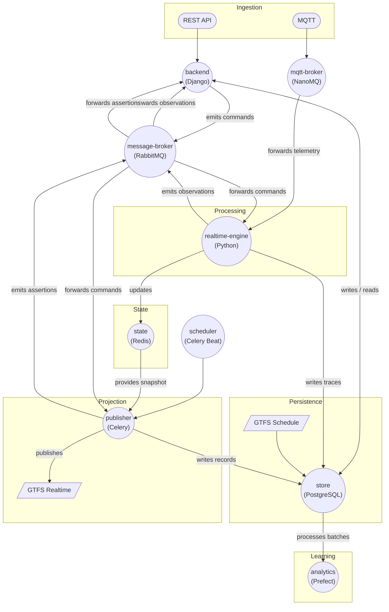
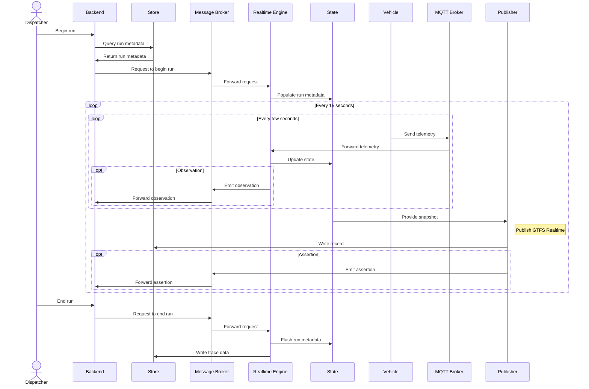

# ARCHITECTURE.md

## 1. Purpose of this document

This document describes the current high-level architecture of the system, the responsibilities of each service, and the communication patterns between them.

Its goals are to:

- Make architectural decisions explicit
- Define clear ownership boundaries
- Reduce accidental coupling between services
- Serve as a long-lived reference for contributors and future maintainers

This document is **not** a low-level implementation guide. Internal details may evolve as long as the mandates and principles described here are respected.

## 2. System overview

The system ingests real-time vehicle telemetry, maintains an authoritative in-memory operational state, produces GTFS Realtime feeds, persists operational traces, and supports analytics and auditing workflows.

Architecturally, the system is divided into:

- **Ingestion** (external signals and APIs)
- **Processing** (real-time reasoning and coordination)
- **State** (authoritative operational memory)
- **Persistence** (durable storage)
- **Projection** (GTFS Realtime outputs)
- **Learning** (analytics and modeling)

Real-time decision-making and batch analytics are intentionally decoupled.

## 3. High-level architecture diagram

Circular nodes represent long-running services or infrastructure components.

## 4. Architectural principles

1. **Single writer per responsibility**  
   Each concern has exactly one authoritative service.

2. **Explicit message semantics**  
   Commands, observations, and assertions are distinct and intentional.

3. **In-memory state is authoritative for real-time**  
   Databases are not used as coordination mechanisms.

4. **Async-first, loosely coupled services**  
   Services communicate via brokers, not synchronous calls.

5. **Auditability over raw data hoarding**  
   Meaningful derived facts are preserved; raw signals are transient.

## 5. Services and mandates

### Backend (Django)

**Role**  
System authority and control plane.

**Responsibilities**

- Owns authoritative domain schemas and models
- Issues commands to start/end runs
- Persists domain events, observations, and assertions
- Exposes HTTP APIs

**Does NOT**

- Process real-time telemetry
- Maintain operational state
- Perform real-time inference

**Emits**

- `commands`

**Consumes**

- `observations`
- `assertions`

**Persistence**

- PostgreSQL via Django ORM

### Realtime Engine

**Role**  
Real-time reasoning and state evolution.

**Responsibilities**

- Consumes telemetry and commands
- Maintains operational logic
- Updates authoritative state
- Emits observations
- Writes operational traces

**Does NOT**

- Serve APIs
- Own schemas
- Publish GTFS feeds

**Emits**

- `observations`

**Consumes**

- `commands`
- telemetry

### State (Redis)

**Role**  
Authoritative in-memory operational state.

**Responsibilities**

- Maintain current run state
- Serve snapshots to publisher

**Does NOT**

- Persist historical data
- Apply business logic

### Publisher

**Role**  
Projection layer for GTFS Realtime.

**Responsibilities**

- Consume state snapshots
- Produce GTFS Realtime feeds
- Persist GTFS RT blobs
- Emit assertions about published output

**Does NOT**

- Interpret raw telemetry
- Modify operational state

**Emits**

- `assertions`

### Message Broker (RabbitMQ)

**Role**  
Asynchronous coordination backbone.

**Responsibilities**

- Route commands, observations, and assertions
- Decouple producers from consumers

**Does NOT**

- Apply business logic
- Persist domain truth

---

### Store (PostgreSQL)

**Role**  
Durable persistence layer.

**Responsibilities**

- Store domain data, traces, GTFS RT blobs
- Support batch analytics

---

### Analytics (Prefect)

**Role**  
Learning and offline processing.

**Responsibilities**

- Consume batch data
- Train models
- Produce insights

---

### Scheduler

**Role**  
Temporal orchestration.

**Responsibilities**

- Trigger periodic publishing
- Coordinate time-based workflows

---

## 6. Messaging model and semantics

| Producer        | Message type | Meaning                        |
| --------------- | ------------ | ------------------------------ |
| Backend         | Commands     | Intentional requests           |
| Realtime Engine | Observations | Derived facts                  |
| Publisher       | Assertions   | Claims about published outputs |

All internal messages share a common envelope and include correlation metadata.

## 7. Communication boundaries

### Internal messaging

- Protocol: AMQP
- Audience: internal services
- Spec: AsyncAPI (domain)

### External telemetry

- Protocol: MQTT
- Audience: vehicles and devices
- Spec: AsyncAPI (telemetry)

External telemetry is treated as untrusted signal and must be interpreted before entering the domain messaging layer.

## 8. Lifecycle example

## 9. Persistence strategy

- Backend persists authoritative domain data
- Realtime Engine persists operational traces
- Publisher persists GTFS Realtime blobs (retained ~1 year)
- Analytics consumes batch data only

## 10. Evolution and governance

This document must be updated alongside any architectural change that violates the mandates described above.
