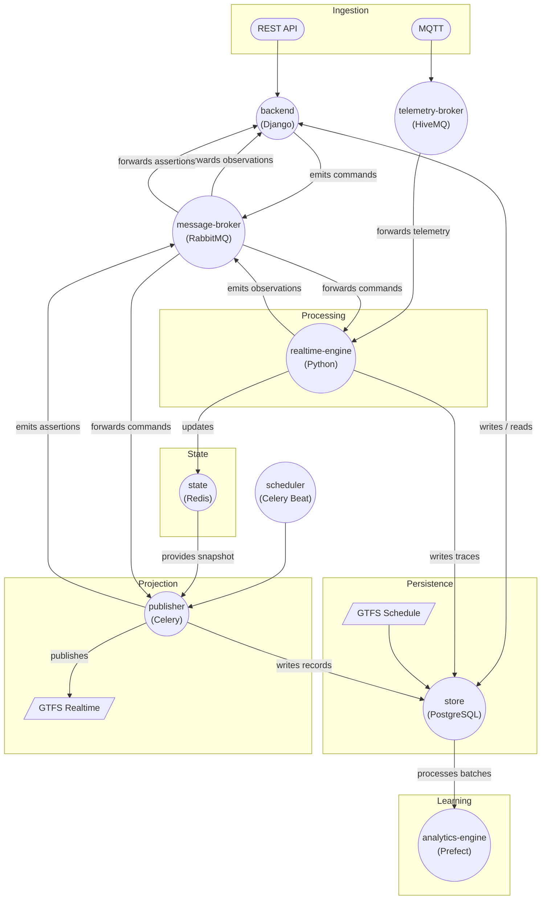
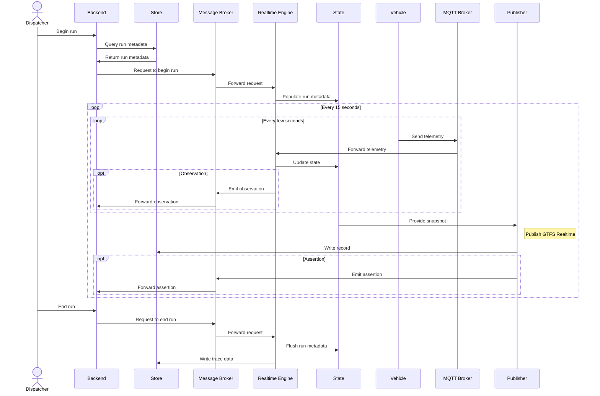
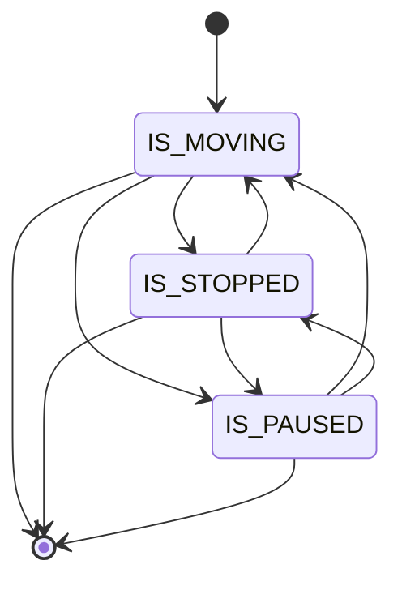

# Functional Diagram

| Layer            | Services                            |
| ---------------- | ----------------------------------- |
| Ingestion        | `backend`, `telemetry-broker`       |
| State            | `state`                             |
| Persistence      | `store`                             |
| Event processing | `realtime-engine`, `message-broker` |
| Projection       | `publisher`, `scheduler`            |
| Learning         | `analytics-engine`                  |

## A Day in the Life of a Run

GTFS-Realtime is a periodically published, contract-bound projection of a continuously evolving system state.

I'm observing a system (run) that evolves through a small number of meaningful states

FSMs shine because transitions encode semantics.

FSM execution produces a trace. A trace is a sequence of labeled transitions. Labels carry data.
