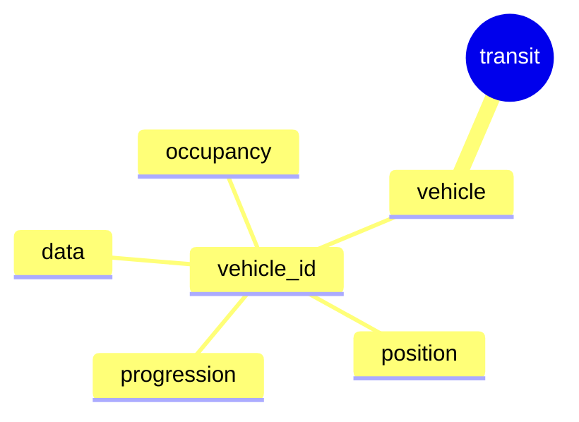

# MQTT topics and Redis keys

```mermaid
mindmap
    root((transit))
        vehicle
            vehicle_id
                data
                position
                progression
                occupancy
```

MQTT topics are mapped 1:1 into Redis keys.
