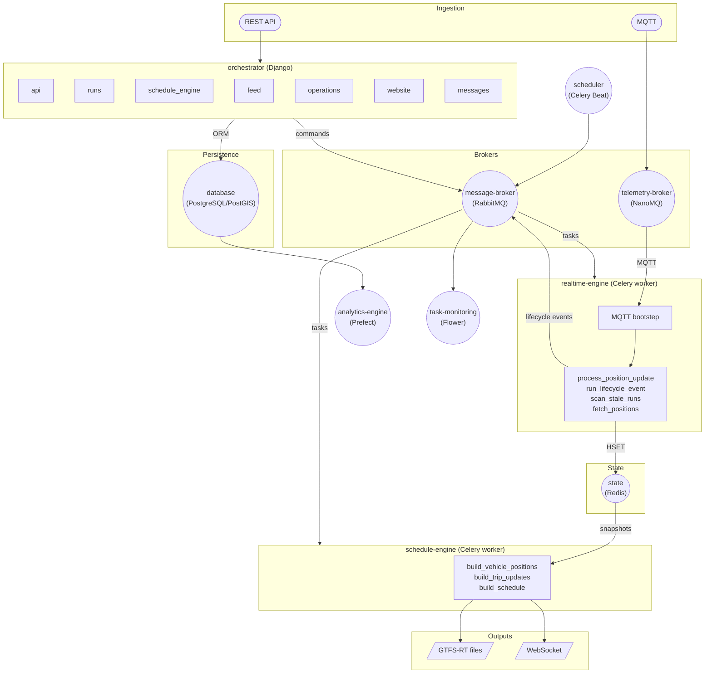

# Architecture

Databús is a distributed transit data platform composed of Django apps and Celery workers, all deployed as Docker Compose services. The sections below unpack the system from every angle.

| Page | What it covers |
|---|---|
| [System overview](overview.md) | Six-layer model: Ingestion → Projection |
| [Services & mandates](services.md) | Per-service role, responsibilities, and boundaries |
| [Messaging model](messaging.md) | Commands, observations, assertions; AMQP exchange layout |
| [State & persistence](state-and-persistence.md) | Redis (authoritative) vs PostgreSQL (durable) |
| [Deployment topology](deployment-topology.md) | Compose services, queue routing, dev vs prod |
