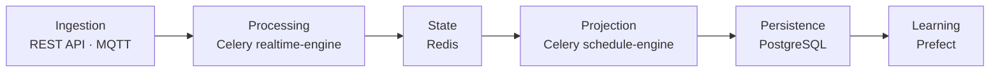

# System overview

Databús is structured around six functional layers. Each layer has a single authoritative owner; the boundaries are enforced by service mandates (see [Services & mandates](services.md)) rather than code gates.

## The six layers

### Ingestion

External signals enter the platform at two surfaces:

- **REST API** — the `api` Django app accepts operator commands (create-run, confirm, complete, interrupt, short-turn). Authenticated via DRF token auth.
- **MQTT telemetry** — vehicles publish GPS and occupancy to the `telemetry-broker` (NanoMQ) on topics of the form `transit/vehicle/<id>/{position,occupancy}`. The `realtime-engine` Celery worker picks these up via its embedded MQTT bootstep.

### Processing

The `realtime-engine` worker converts raw telemetry into domain state:

1. Parses and validates each MQTT message.
2. Writes the telemetry leaf to Redis (`vehicle:<id>:position` or `:occupancy`).
3. Enqueues `process_position_update` as a Celery task, which runs server-side map-matching and detection off the paho network thread.
4. Fires lifecycle events (`run_tracking_started`, `run_started`, `run_completed`, …) via `run_lifecycle_event` tasks.

### State

Redis (`state` service) holds the **authoritative real-time picture** of every active run and vehicle. It is the only coordination point between the processing and projection layers. The `realtime-engine` is the sole writer of run/vehicle state; the `schedule-engine` reads it as a snapshot. See [State & persistence](state-and-persistence.md) and [Redis state keys](../data-model/redis-keys.md) for the full key reference.

### Projection

Every 15 seconds the `scheduler` fires `build_vehicle_positions` and `build_trip_updates` on the `schedule-engine` worker. That worker reads the Redis snapshot, converts it to protobuf and JSON, and writes GTFS-RT files to `backend/feed/files/`. Alerts are rebuilt every 10 seconds (currently a stub returning an empty feed). See [GTFS Realtime publishing](../data-flow/gtfs-rt-publishing.md).

### Persistence

PostgreSQL (`database` service, PostGIS extension) stores:

- Authoritative domain records (runs, vehicles, operators, GTFS schedule).
- Run lifecycle state transitions.
- GTFS-RT blobs retained approximately one year.

The `orchestrator` (Django HTTP server) is the sole ORM writer for domain records. The `realtime-engine` writes operational traces.

### Learning

`analytics-engine` (Prefect) consumes batch data from PostgreSQL for offline analysis and model training. It is operationally independent of the real-time path.

## Mapping layers to services

| Layer | Compose service | Technology |
|---|---|---|
| Ingestion (HTTP) | `orchestrator` | Django + Daphne |
| Ingestion (MQTT) | `realtime-engine` bootstep | paho-mqtt inside Celery |
| Processing | `realtime-engine` | Celery worker, queue `realtime_engine` |
| State | `state` | Redis 7 |
| Projection | `schedule-engine` | Celery worker, queue `schedule_engine` |
| Timing | `scheduler` | Celery Beat |
| Persistence | `database` | PostgreSQL 15 + PostGIS |
| Learning | `analytics-engine` | Prefect 3 |
| Broker | `message-broker` | RabbitMQ 4 |
| Telemetry broker | `telemetry-broker` | NanoMQ 0.24.9 |

!!! note "What AGENTS.md describes vs what exists"
    `AGENTS.md` and `MODEL.md` describe a `publisher/` project separate from `schedule_engine`. That project does not exist. GTFS-RT is produced by the `schedule_engine` Django app running inside the `schedule-engine` Celery worker. When in doubt, the compose files and `backend/*/apps.py` are authoritative.
