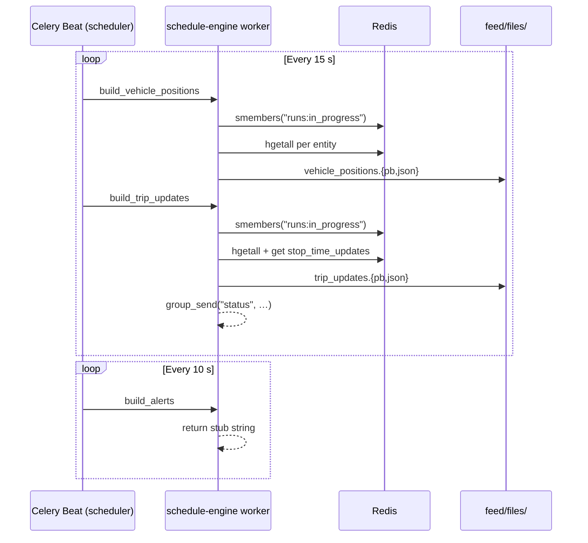

# GTFS Realtime publishing

GTFS-RT feeds are produced by the `schedule-engine` Celery worker, not by a separate publisher service. Celery Beat fires the publishing tasks on a fixed schedule; each task reads a snapshot from Redis, assembles a feed dict, and writes protobuf + JSON files to disk.

!!! note "Correcting the old architecture docs"
    `AGENTS.md` and `MODEL.md` describe a separate `publisher` service. That service does not exist. GTFS-RT publishing is handled by `schedule_engine` tasks running in the `schedule-engine` Celery worker. The builder code lives in `backend/schedule_engine/tasks.py` and `backend/schedule_engine/builders.py`.

## Beat schedule

Defined in `backend/databus/celery.py` — in code, not in the `django_celery_beat` database:

```python
app.conf.beat_schedule = {
    "build-vehicle-positions-every-15s": {
        "task": "schedule_engine.tasks.build_vehicle_positions",
        "schedule": timedelta(seconds=15),
    },
    "build-trip-updates-every-15s": {
        "task": "schedule_engine.tasks.build_trip_updates",
        "schedule": timedelta(seconds=15),
    },
    "build-alerts-every-10s": {
        "task": "schedule_engine.tasks.build_alerts",
        "schedule": timedelta(seconds=10),
    },
    "scan-stale-runs-every-30s": {
        "task": "realtime_engine.tasks.scan_stale_runs",
        "schedule": timedelta(seconds=30),
    },
}
```

| Task | Queue | Cadence | Output |
|---|---|---|---|
| `build_vehicle_positions` | `schedule_engine` | 15 s | `vehicle_positions.{pb,json}` |
| `build_trip_updates` | `schedule_engine` | 15 s | `trip_updates.{pb,json}` + WebSocket push |
| `build_alerts` | `schedule_engine` | 10 s | stub (returns `"Feed ServiceAlert built"`) |
| `scan_stale_runs` | `realtime_engine` | 30 s | lifecycle events only |

!!! warning "Alerts are a stub"
    `build_alerts` returns a string and does not write any file. ServiceAlert support is designed but not yet implemented.

## Feed assembly: pure builders

`backend/schedule_engine/builders.py` is the Django-free half of the pipeline. It imports nothing from Celery, Django, or Channels — only from `runs.domain.telemetry.*` and `keys`. This makes it unit-testable with a fake Redis client.

```text
tasks.py  →  builders.py  →  runs.domain.telemetry.*  →  keys
```

Each task calls a builder function, receives a feed dict, serialises it to JSON and protobuf, and writes the output files.

### VehiclePositions feed

`build_vehicle_positions_feed(r)` iterates `runs:in_progress` and calls `build_vehicle_position_entity(r, run_id)` for each run. An entity is skipped (`None`) when all of `position`, `occupancy`, and `stop_status` hashes are absent.

For each entity the builder reads:

| Redis key | Contract | Used for |
|---|---|---|
| `run:<id>` | run hash | `vehicle_id`, trip/route fields |
| `vehicle:<id>:position` | `position.from_redis` | lat, lon, bearing, speed, timestamp |
| `vehicle:<id>:occupancy` | `occupancy.from_redis` | `occupancy_status`, `occupancy_percentage` |
| `run:<id>:vehicle_stop_status` | `vehicle_stop_status.from_redis` | `current_stop_sequence`, `stop_id`, `current_status` |
| `vehicle:<id>:metadata` | raw hash | `id`, `label`, `license_plate` |
| `run:<id>:congestion_level` | `congestion_level.from_redis` | `congestion_level` (deferred) |
| `run:<id>:trip` | `trip.from_redis` | `trip_id`, `route_id`, `direction_id`, `schedule_relationship` |

!!! note "occupancy_count is not emitted"
    The GTFS-RT `VehiclePosition` message does not have an `occupancy_count` field. Emitting it would cause `json_format.ParseDict` to raise an unknown-field error. Only `occupancy_status` and `occupancy_percentage` are included.

### TripUpdates feed

`build_trip_updates_feed(r)` follows the same iteration pattern. Each entity assembles a `TripUpdate` with:

- A trip descriptor and vehicle descriptor from the run hash.
- `stop_time_update` entries from `run:<id>:stop_time_updates` (a Redis string key holding a JSON array, written by `produce_stop_times` with a 60-second TTL).

The stop-time-updates entry shape:

```json
{
    "stop_sequence": 5,
    "stop_id": "UCR-1",
    "arrival": {"time": 1750300800, "uncertainty": 120},
    "departure": {"time": 1750300800, "uncertainty": 120}
}
```

When the key is missing or expired, `stop_time_update` in the feed is an empty list — the builder does not emit fabricated arrival times.

## Protobuf serialisation

Both tasks use the same two-step serialisation:

```python
feed_message_json = json.dumps(feed_message)
# ...
feed_dict = json.loads(feed_message_json)
feed_message_pb = json_format.ParseDict(feed_dict, gtfs_rt.FeedMessage())
with open(output_dir / "vehicle_positions.pb", "wb") as f:
    f.write(feed_message_pb.SerializeToString())
```

`json_format.ParseDict` from `google.protobuf` performs field validation as part of the conversion. Unknown fields cause a hard failure.

## Output files

All files are written to `backend/feed/files/` (created on first run):

```text
backend/feed/files/
├── vehicle_positions.pb    # GTFS-RT protobuf, refreshed every 15 s
├── vehicle_positions.json  # Debug JSON, same content
├── trip_updates.pb         # GTFS-RT protobuf, refreshed every 15 s
└── trip_updates.json       # Debug JSON, same content
```

The `feed` Django app serves these files via a static-file route. In production the `static_files` nginx service (see [Deployment](../operations/deployment.md)) serves them from a shared volume.

## Feed cadence diagram



## Related pages

- [Live updates (WebSocket)](live-updates.md) — the `group_send` call inside `build_trip_updates`.
- [GTFS Realtime feeds](../interfaces/gtfs-rt-feeds.md) — external consumer reference for the output files.
- [Celery workers, queues & beat](../operations/celery.md) — beat schedule and queue routing.
- [Data model: Redis keys](../data-model/redis-keys.md) — all keys read by the builders.
- [Map-matching & progression](map-matching.md) — how `run:<id>:vehicle_stop_status` is produced.
