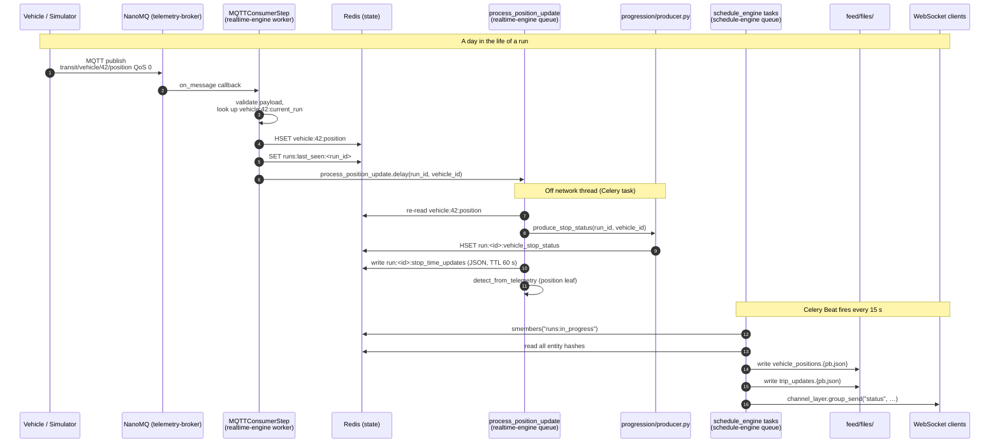

# Data flow

Databús® moves data through five sequential stages, from raw vehicle telemetry to published GTFS Realtime feeds and live WebSocket updates. Each stage is handled by a specific service and the hand-off between stages is always explicit — either an MQTT message, a Celery task, or a Redis write.

| Page | What it covers |
|---|---|
| [Telemetry ingestion](telemetry-ingestion.md) | MQTT consumer bootstep, topic subscriptions, per-leaf pipeline |
| [Server-side processing](server-processing.md) | `process_position_update` Celery task and its four steps |
| [Map-matching & progression](map-matching.md) | GPS→polyline projection, three-state radius rules, monotonic guard |
| [GTFS Realtime publishing](gtfs-rt-publishing.md) | Beat schedule, builders, output files |
| [Live updates (WebSocket)](live-updates.md) | Django Channels `status` group and frontend heartbeat |
