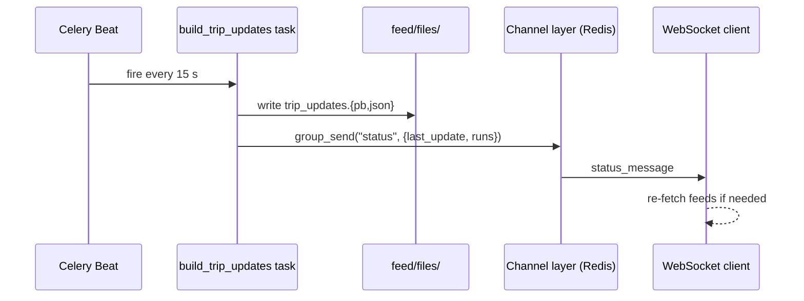

# Live updates (WebSocket)

The `build_trip_updates` Celery task pushes a lightweight heartbeat message to connected WebSocket clients each time a TripUpdates feed is built (every 15 seconds). This is the primary mechanism by which the Nuxt frontend knows when new data is available.

## Django Channels setup

The `orchestrator` service runs Daphne (ASGI). `backend/databus/asgi.py` routes WebSocket connections to `schedule_engine.routing`:

```python
application = ProtocolTypeRouter({
    "http": get_asgi_application(),
    "websocket": URLRouter(websocket_urlpatterns),
})
```

`backend/schedule_engine/routing.py` maps the single WebSocket endpoint:

```python
websocket_urlpatterns = [
    re_path(r"ws/status/$", StatusConsumer.as_asgi()),
]
```

Clients connect to `ws://<host>/ws/status/` and are added to the `"status"` channel group by `StatusConsumer`.

## The heartbeat push

Inside `build_trip_updates` (`backend/schedule_engine/tasks.py`), after writing the protobuf and JSON files to disk, the task sends a message to the `"status"` group:

```python
channel_layer = get_channel_layer()
if channel_layer:
    async_to_sync(channel_layer.group_send)(
        "status",
        {
            "type": "status_message",
            "message": {
                "last_update": datetime.now().strftime("%Y-%m-%d %H:%M:%S"),
                "runs": len(runs_in_progress),
            },
        },
    )
```

The message payload carries two fields:

| Field | Type | Meaning |
|---|---|---|
| `last_update` | string | Formatted datetime of the current build (`YYYY-MM-DD HH:MM:SS`) |
| `runs` | int | Count of runs currently in `runs:in_progress` |

`async_to_sync` bridges the synchronous Celery task context into Django Channels' async channel layer. Failures are silently swallowed (`except Exception: pass`) so that a misconfigured channel layer never breaks the GTFS-RT file write.

!!! note "This is a UI heartbeat, not a diff stream"
    The WebSocket message does not carry position data or stop-time predictions — those live in the GTFS-RT files on disk. The frontend uses this message as a signal to re-fetch whichever feeds it needs. The 15-second cadence is driven by the `build_trip_updates` beat schedule, not by a separate timer.

## Message flow



## Channel layer backend

Django Channels requires a channel layer backend for group messaging. The production setup uses `channels_redis` (Redis as the channel layer transport), sharing the same `state` Redis service used for telemetry state. The channel layer configuration lives in Django settings under `CHANNEL_LAYERS`.

## Related pages

- [GTFS Realtime publishing](gtfs-rt-publishing.md) — the task that triggers this push.
- [Celery workers, queues & beat](../operations/celery.md) — beat schedule cadence.
- [Architecture: services](../architecture/services.md) — the `orchestrator` service and Daphne.
