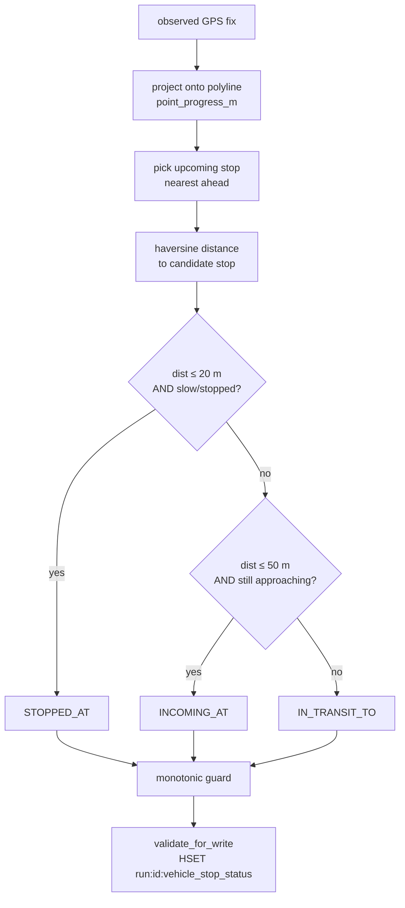

# Map-matching & progression

Server-side progression replaces the decommissioned edge-sent `progression` MQTT leaf. On every position tick, the server projects the vehicle's GPS fix onto the GTFS shape polyline, identifies the upcoming stop, and assigns one of three stop statuses. This page describes the algorithm and the pure/impure module boundary.

## Module boundary: `compute.py` vs `producer.py`

The map-matching logic is split into two modules:

| Module | Role | I/O |
|---|---|---|
| `backend/runs/domain/progression/compute.py` | Pure computation — no Redis, no ORM, no side effects | Takes dicts, returns a dict |
| `backend/runs/domain/progression/producer.py` | Impure glue — reads from Redis, calls `compute.py`, writes back | Redis client, side effects |

This boundary exists so the algorithm can be unit-tested in isolation (`pytest` without a Django setup), while the producer handles all the Redis plumbing. `producer.py` is called by `process_position_update` in `backend/realtime_engine/tasks.py`.

## The geometry layer: `shapes.py`

Before map-matching can run, the shape geometry must be loaded. `backend/runs/domain/progression/shapes.py` provides:

- `build_polyline` — converts raw GTFS shape rows to a list of `(lat, lon, cum_dist_m)` tuples. Cumulative distance is computed by haversine between consecutive points; when the GTFS feed provides `shape_dist_traveled`, those values are used after a sanity check (`[0.5, 2.0] × haversine_total`).
- `build_stops` — projects each stop onto the polyline using a Viterbi/prefix-min DP algorithm (`assign_stops_monotonic`) that enforces a forward-monotonic constraint on segment assignment. This correctly handles loop-back and doubling-back shapes where a naive nearest-segment search would snap a late stop to an early segment.
- `get_shape_geometry` — cached wrapper around the ORM loader. The cache is a module-level dict keyed by `(feed_id, shape_id, trip_id)`. Call `invalidate_cache()` after a GTFS feed import.

The result is a frozen `ShapeGeometry` dataclass:

```python
@dataclass(frozen=True)
class ShapeGeometry:
    shape_id: str
    trip_id: str
    polyline: tuple[tuple[float, float, float], ...]  # (lat, lon, cum_dist_m)
    stops: tuple[dict, ...]  # {stop_id, stop_sequence, lat, lon, progress_m}
```

## The point projection: `geo.py`

`backend/runs/domain/progression/geo.py` provides pure geometry primitives:

- `haversine_m(lat1, lon1, lat2, lon2)` — great-circle distance in metres (Earth radius 6 371 000 m, ported from the simulator).
- `project_point_to_polyline(lat, lon, polyline)` — global search over all segments; returns `{progress_m, cross_track_m, segment_idx}` where `progress_m` is the along-track distance to the foot of perpendicular. Uses local equirectangular projection centred on each segment start to avoid trig overhead.

## The core algorithm: `compute.py`

`compute_stop_status(run_hash, position_hash, prev_state=None)` is the public entry point. It never raises — all exceptions are caught and fall back to the defensive `IN_TRANSIT_TO` carry-forward. The module docstring is the canonical algorithm specification:

### Step 1 — resolve shape and trip IDs

Read `shape_id` and `trip_id` from `run_hash`. If either is absent, fall back immediately.

### Step 2 — load shape geometry

```python
geom = shapes.get_shape_geometry(shape_id, trip_id)
```

Returns `None` when no current GTFS feed exists or when the shape/trip has no data.

### Step 3 — project the observed GPS point

```python
proj = shapes.project_point_to_polyline(observed_lat, observed_lon, list(geom.polyline))
point_progress_m: float = proj["progress_m"]
```

`point_progress_m` is the vehicle's along-track distance from the shape start.

### Step 4 — pick the upcoming stop

```python
candidate = _pick_upcoming_stop(geom.stops, point_progress_m)
```

The upcoming stop is the stop with the smallest `progress_m` that is greater than or equal to `point_progress_m`. If the vehicle has passed all stops, the terminal stop is returned.

### Step 5 — distance and three-state radius rules

Compute the haversine distance from the observed point to the candidate stop, then apply:

```
distance <= STOP_RADIUS_M (20 m)
  AND (speed unknown OR speed <= STATIONARY_SPEED_MPS (0.5 m/s))
→ STOPPED_AT

distance <= INCOMING_AT_RADIUS_M (50 m)
  AND point_progress_m < candidate.progress_m  (still approaching)
→ INCOMING_AT

otherwise
→ IN_TRANSIT_TO
```

The speed threshold (0.5 m/s ≈ 1.8 km/h) distinguishes genuine dwell at a stop from slow roll-through.



### Step 6 — monotonic sequence floor

The algorithm never allows the chosen `stop_sequence` to regress relative to `prev_state`:

```python
if prev_seq is not None and chosen_seq < prev_seq:
    chosen_seq = prev_seq
    chosen_stop_id = prev_state.get(vehicle_stop_status.STOP_ID, chosen_stop_id)
```

This mirrors the simulator's debounce: once the server has committed to a stop sequence, it only advances when the vehicle moves past that stop. GPS jitter near a stop cannot cause the status to bounce backwards.

### Fallback: `IN_TRANSIT_TO` carry-forward

Any exception in the above steps (ORM failure, missing GTFS data, unexpected payload shape) falls back to:

```python
{
    "current_status": "IN_TRANSIT_TO",
    # + carry-forward of prev_state sequence and stop_id if available
}
```

The fallback always passes `vehicle_stop_status.validate_for_write`, so the producer can always write a valid hash to Redis.

## Tunable constants

Defined at the top of `compute.py`:

| Constant | Value | Meaning |
|---|---|---|
| `STOP_RADIUS_M` | `20.0` m | Inner radius — vehicle is at the stop |
| `INCOMING_AT_RADIUS_M` | `50.0` m | Outer radius — vehicle is approaching |
| `STATIONARY_SPEED_MPS` | `0.5` m/s | Speed at or below which a vehicle qualifies as stationary |

## Result contract

`compute_stop_status` always returns a dict compatible with `vehicle_stop_status.validate_for_write`:

```python
{
    "current_status": "STOPPED_AT" | "INCOMING_AT" | "IN_TRANSIT_TO",
    "current_stop_sequence": int,   # optional
    "stop_id": str,                 # optional
}
```

This dict is written to `run:<run_id>:vehicle_stop_status` by `producer.py` and then re-fed into the detection layer as the synthetic `"progression"` leaf to drive `RunCompletedDetector`.

## Downstream: the ETA / stop-time-updates projection

`run:<run_id>:vehicle_stop_status` (produced above) feeds a second projection: predicted arrival/departure times for upcoming stops, written to `run:<run_id>:stop_time_updates` and consumed by the TripUpdates GTFS-RT feed (see [Server-side processing](server-processing.md), step 3, and [GTFS Realtime publishing](gtfs-rt-publishing.md)).

The pure/impure split mirrors `compute.py` / `producer.py`:

| Module | Role |
|---|---|
| `compute_stop_time_updates` (`backend/runs/domain/progression/stop_times.py`) | Pure: builds the `upcoming_stops` list from `geom.stops` filtered by `current_stop_sequence`/`current_status`, then calls the ETA estimator. |
| `produce_stop_times` (same file) | Impure glue: reads `run:<run_id>`, `vehicle:<id>:position`, and `run:<run_id>:vehicle_stop_status` from Redis, resolves `ShapeGeometry` via the same `shapes.get_shape_geometry` cache used above, and conditionally writes the result. |

The estimator call itself, `gtfs_eta.eta_service.estimator.estimate_stop_times(...)`, is imported **lazily inside the function** — this is a deliberate seam so a missing/unconfigured ETA model registry (`MODEL_REGISTRY_DIR`) never breaks Celery worker startup. `ETA_MAX_STOPS` (default `3`) caps how many upcoming stops are sent to the estimator per tick; `ETA_DEFAULT_UNCERTAINTY_S` (default `120`) is the uncertainty value attached to every prediction.

Unlike `compute_stop_status`, which always writes a fallback, `produce_stop_times` writes **only when the estimator returns at least one prediction** — an estimator error or an untrained route leaves the previous `run:<run_id>:stop_time_updates` value untouched, to expire on its own 60-second TTL rather than being overwritten with an empty array.

## Related pages

- [Server-side processing](server-processing.md) — where `produce_stop_status` and `produce_stop_times` are called in the task pipeline.
- [Detection layer](../runs/detection.md) — how the computed stop status drives the run lifecycle.
- [Data model: telemetry contracts](../data-model/telemetry-contracts.md) — `vehicle_stop_status` contract definition.
- [GTFS Realtime publishing](gtfs-rt-publishing.md) — how the computed status and stop-time-updates appear in GTFS-RT feeds.
