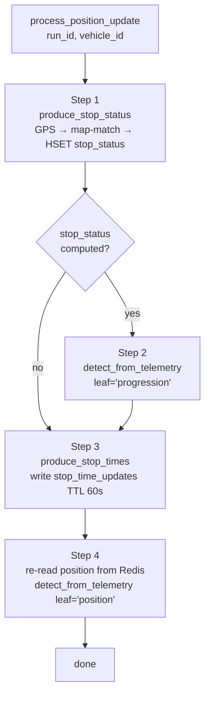

# Server-side processing

Every incoming `position` MQTT message triggers a `process_position_update` Celery task. This page explains why that indirection exists and what the task does in its four sequential steps.

## Why heavy work runs off the network thread (commit 8a82d37)

The MQTT consumer's `on_message` callback executes on paho's network thread. If any work done inside that callback blocks — a database query, a map-matching computation, a Redis pipeline — paho cannot process the next incoming message until the callback returns. Under load, this creates head-of-line blocking: a slow ORM query on one message delays every subsequent message for all vehicles.

The solution (introduced in commit `8a82d37`) is to:

1. Do the minimum synchronous work in the callback: parse, validate, write to Redis, update `last_seen`.
2. Enqueue `process_position_update.delay(run_id, vehicle_id)` and return immediately.
3. Let the `realtime_engine` Celery queue drain the heavy work asynchronously.

The task signature intentionally passes only `run_id` and `vehicle_id` — no telemetry data. The task **re-reads** the latest position from Redis, so multiple rapid MQTT messages coalesce: if the queue is briefly backed up, the task processes the freshest value and older intermediate positions are skipped. This is the correct behaviour for a live position feed.

```python
@shared_task(queue="realtime_engine")
def process_position_update(run_id: str, vehicle_id: str) -> None:
    """Run server-side producers and detection for a position update.
    ...
    No retries (a retried tick is stale; the next ping recovers).
    """
```

!!! note "No retries by design"
    `process_position_update` has no retry policy. A stale telemetry tick that fails to process is correctly abandoned — the next position update from the vehicle will recover. Retrying would consume queue capacity processing data that is already outdated.

## The four steps

### Step 1: stop-status production (map-matching)

```python
from runs.domain.progression.producer import produce_stop_status
computed_stop_status = produce_stop_status(run_id, vehicle_id)
```

`produce_stop_status` (`backend/runs/domain/progression/producer.py`) is the impure glue layer:

1. Read `vehicle:<id>:position` from Redis.
2. Read `run:<run_id>` (the run hash — carries `shape_id` and `trip_id`).
3. Read `run:<run_id>:vehicle_stop_status` as the previous state.
4. Call `compute_stop_status(run_hash, position_hash, prev_state=prev_state)` — the pure map-matching function (see [Map-matching & progression](map-matching.md)).
5. Validate the result and `HSET run:<run_id>:vehicle_stop_status`.

If no position data is available, `produce_stop_status` returns `None` and step 2 is skipped.

### Step 2: completion detection

The server-computed stop status is re-fed into the telemetry detection layer under the `"progression"` leaf name:

```python
if computed_stop_status:
    detect_from_telemetry(run_id, vehicle_id, "progression", computed_stop_status)
```

This is how `RunCompletedDetector` works post-decommission: it no longer reads an edge-sent `progression` MQTT message. Instead, it receives the server-computed `vehicle_stop_status` dict that carries `current_status` and `stop_id`. When `current_status == "STOPPED_AT"` at a terminal stop, the detector fires `run_completed`.

!!! note "Why the leaf name is still 'progression'"
    `RunCompletedDetector` was written to match the `"progression"` leaf and inspect `current_status`. Passing the server-computed dict under the same leaf name preserved backward compatibility with the detector contract without touching the detection layer. The leaf is now synthetic (server-generated), not edge-sent.

### Step 3: stop-time-updates projection

```python
from runs.domain.progression.stop_times import produce_stop_times
produce_stop_times(run_id, vehicle_id)
```

`produce_stop_times` (`backend/runs/domain/progression/stop_times.py`) reads the current run hash and stop-status progression from Redis, delegates to `schedule_engine.fake_stop_times.build_stop_time_updates`, maps the output to the typed contract, and writes the JSON array to `run:<run_id>:stop_time_updates` with a 60-second TTL:

```python
STOP_TIME_UPDATES_TTL_S = 60
r.set(keys.stop_time_updates_key(run_id), payload, ex=STOP_TIME_UPDATES_TTL_S)
```

The TTL ensures that if a vehicle goes silent, the GTFS-RT builder reads an empty/expired key rather than serving stale arrival predictions.

### Step 4: position-leaf detection

The task re-reads the latest position from Redis and passes it to the detection layer under the `"position"` leaf:

```python
raw_position = redis_client.hgetall(keys.position_key(vehicle_id))
if raw_position:
    latest_position = position.from_redis(raw_position)
    detect_from_telemetry(run_id, vehicle_id, "position", latest_position)
```

This is where `RunStartedDetector` fires: it checks `speed > 0.5 m/s` on the position dict. By re-reading from Redis (rather than using the original MQTT payload), the task sees the same typed dict that `position.from_redis` produces — including the `speed` field as a float.

## Processing pipeline



Each step is wrapped in its own `try/except`. A failure in any one step is logged and does not abort the remaining steps — the task always attempts all four phases.

## Occupancy: inline, not off-thread

Occupancy processing (`HSET vehicle:<id>:occupancy` + lifecycle detection) remains inline in the MQTT callback and is not delegated to a Celery task. There are two reasons:

1. `RunTrackingStartedDetector` and `RunTrackingRestoredDetector` fire on any valid telemetry leaf, including occupancy. These transitions must happen promptly and should not be delayed by queue latency.
2. Occupancy processing is cheap: no ORM, no map-matching, just a classification function and a hash write.

## Related pages

- [Telemetry ingestion](telemetry-ingestion.md) — the MQTT callback that enqueues this task.
- [Map-matching & progression](map-matching.md) — step 1 in detail.
- [Celery workers, queues & beat](../operations/celery.md) — queue routing and worker configuration.
- [Detection layer](../runs/detection.md) — how `detect_from_telemetry` works.
