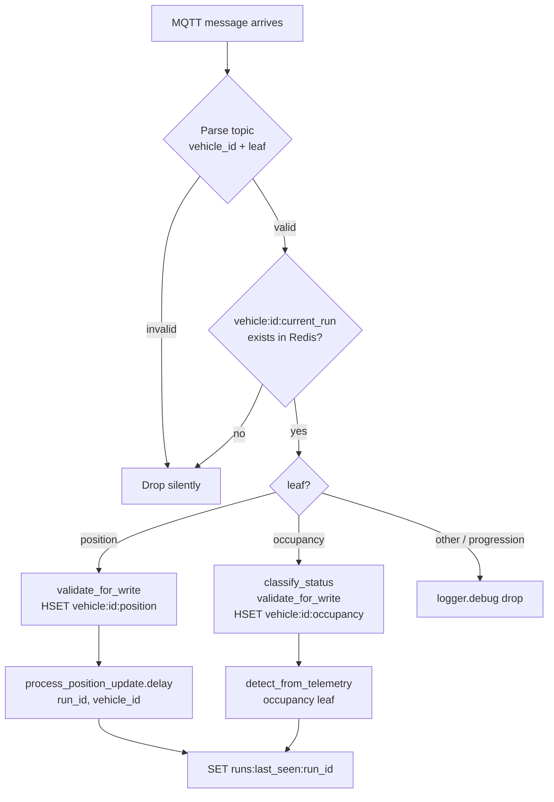

# Telemetry ingestion (MQTT + HTTP polling)

Vehicles publish telemetry to NanoMQ over MQTT. The `realtime-engine` Celery worker picks it up through an in-process bootstep and routes it into Redis. A second path exists for devices that only expose an HTTP+JSON endpoint: the `fetch_positions` Celery Beat task polls them and republishes onto the same MQTT topic, so everything below this point in the pipeline is identical regardless of which path produced the message (see [HTTP polling: a second producer](#http-polling-a-second-producer) below).

## The MQTT consumer is a Celery bootstep

The consumer (`backend/realtime_engine/mqtt.py`) is a `celery.bootsteps.StartStopStep` — not a standalone service or a separate Celery task. It starts when the `realtime-engine` worker boots and shuts down when the worker shuts down.

paho's `loop_start()` runs the network loop in its own background thread, so ingestion never blocks Celery task execution in the same process.

```
realtime-engine worker
├─ Celery Pool (task execution)
└─ MQTTConsumerStep (bootstep)
   └─ paho network thread (loop_start)
        subscribes: transit/vehicle/+/position   QoS 0
                    transit/vehicle/+/occupancy  QoS 0
```

The bootstep is registered globally in `backend/databus/celery.py`:

```python
from realtime_engine.mqtt import MQTTConsumerStep
app.steps["worker"].add(MQTTConsumerStep)
```

### Why a bootstep and not a separate service?

The earlier design had a dedicated `realtime-consumer` container. That added an extra Docker build target, an extra bind-mount on the backend tree, and an extra process to monitor — at a scale the project does not require. paho's network loop already runs in its own thread, so there is no contention with Celery task execution.

## The `MQTT_CONSUMER_ENABLED` gate

The bootstep is registered on every worker that loads `databus.celery` — including the `schedule-engine` worker and the Celery beat process. To prevent those workers from also subscribing to the broker, the bootstep checks `MQTT_CONSUMER_ENABLED` at startup:

```python
MQTT_CONSUMER_ENABLED = os.getenv("MQTT_CONSUMER_ENABLED", "false").lower() in (
    "1", "true", "yes",
)
```

Only the `realtime-engine` compose service sets this variable to `true`. Other workers log a single `INFO` line and skip activation.

!!! note "Single-subscriber guarantee"
    `MQTT_CONSUMER_ENABLED` is the authoritative gate. Only one worker process should ever subscribe, so that every MQTT message is processed exactly once. Do not set this on additional workers.

## Per-process client ID (commit 452d4f4)

Each worker instance builds its MQTT client ID from the hostname and PID:

```python
client_id = f"databus-mqtt-consumer-{socket.gethostname()}-{os.getpid()}"
```

Before this fix, a fixed client ID caused an endless reconnect war: the broker treats a second connection with the same ID as a takeover, forcing the first client to reconnect, which triggers another takeover, and so on. Unique per-process IDs mean an accidental duplicate subscriber connects cleanly instead of looping. The `MQTT_CONSUMER_ENABLED` gate is still the real defence; the unique ID prevents the worst-case failure mode if the gate is misconfigured.

## Topic subscriptions

On connect, the consumer subscribes to exactly two wildcard patterns:

```
transit/vehicle/+/position    QoS 0
transit/vehicle/+/occupancy   QoS 0
```

`progression` is **not subscribed** — it is decommissioned at the edge. The server computes vehicle stop status via real GPS→polyline map-matching (see [Map-matching & progression](map-matching.md)). If the simulator publishes a `progression` leaf, the consumer drops it silently at `DEBUG` log level.

```python
# 'progression' is intentionally NOT subscribed — decommissioned.
```

## Per-leaf pipeline

### Topic parsing

The consumer extracts `vehicle_id` and `leaf` from the four-part topic:

```
transit / vehicle / <vehicle_id> / <leaf>
```

Malformed topics (wrong segment count, wrong prefix) are dropped immediately.

### Common guard: active run lookup

Before processing any payload, the consumer looks up `vehicle:<id>:current_run` in Redis. If the key is absent the vehicle has no active run and the message is dropped:

```python
run_id = r.get(keys.current_run_key(vehicle_id))
if not run_id:
    logger.debug("No active run for vehicle %s — dropping %s", vehicle_id, leaf)
    return
```

This avoids writing telemetry for vehicles that are not on a run, which would pollute Redis with orphaned hashes.

### `position` leaf

1. Parse JSON, validate against the position contract (`position.validate_for_write`).
2. `HSET vehicle:<id>:position` with the validated mapping.
3. Enqueue `process_position_update.delay(run_id, vehicle_id)` — the heavy work (map-matching, stop-time projection, detection) runs off the network thread.
4. Write `runs:last_seen:<run_id>` synchronously (see below).

!!! note "Why the HSET happens before enqueuing"
    The Celery task re-reads `vehicle:<id>:position` from Redis. Writing the hash before calling `.delay()` guarantees the task reads at least the value that triggered it. If the worker is briefly busy, subsequent position updates will overwrite the hash (last-write-wins), and when the task eventually runs it processes the freshest data — which is the correct behaviour for a real-time feed.

### `occupancy` leaf

Occupancy is handled entirely inline (no Celery task):

1. Parse JSON.
2. Strip any edge-sent `occupancy_status` — it is a server policy decision:
   ```python
   occ_payload[occupancy.OCCUPANCY_STATUS] = occupancy.classify_status(pct)
   ```
3. Validate and `HSET vehicle:<id>:occupancy`.
4. Call `detect_from_telemetry(run_id, vehicle_id, "occupancy", data)` directly.

!!! note "Why occupancy detection stays inline"
    `RunTrackingStartedDetector` and `RunTrackingRestoredDetector` fire on any valid telemetry leaf, including occupancy. Delegating occupancy to a Celery task would add queue latency to lifecycle transitions that need to fire promptly. Occupancy processing itself is cheap (no ORM, no map-matching), so there is no reason to move it off-thread.

### `last_seen` write (always synchronous)

After processing any leaf, the consumer writes `runs:last_seen:<run_id>` synchronously — before returning from the callback:

```python
r.set(keys.last_seen_key(run_id), now().isoformat())
```

This key drives the stale-run scanner (`scan_stale_runs`, every 30 s). Writing it synchronously ensures staleness detection is never delayed by queue backlog, even when the `realtime_engine` Celery queue is under load.

## HTTP polling: a second producer

Not every telemetry device speaks MQTT. `realtime_engine.tasks.fetch_positions` (`backend/realtime_engine/tasks.py`) is a Celery Beat task — scheduled every 10 s as `fetch-positions` in `backend/databus/celery.py`, with `expires=10` so a poll that couldn't even start within its own cycle is revoked instead of queuing up behind a slow/unreachable source — that polls HTTP+JSON telemetry sources (`backend/realtime_engine/sources/http_json.py`) and republishes what it fetches onto the same `transit/vehicle/<id>/position` topic this bootstep subscribes to. From that point on, ingestion is indistinguishable from a native MQTT publish.

Key behaviors:

- **Same in-service gate as the MQTT consumer.** Only sensors whose assigned vehicle has a `vehicle:<id>:current_run` Redis key are fetched at all (commit `6936b30`) — gating on `runs:in_progress` instead would deadlock a `CONFIRMED` run, since it only reaches `IN_PROGRESS` once telemetry proves the vehicle is moving.
- **`soft_time_limit=25`** on the task: a single pathological source (a host that hangs on every request) can't hold a worker slot indefinitely. On `SoftTimeLimitExceeded` the in-flight sensor is logged and the task returns early without publishing.
- **`DEFAULT_TIMEOUT_S = 5`** on the underlying HTTP adapter's own request (`http_json.py`), independent of the task-level soft limit.
- **Misconfigured sensors are skipped with explicit guards, not exceptions** (commit `ee39467`): a sensor with `source_type="http"`/`"both"` but no `source_http_url` is skipped and logged; a record whose mapping doesn't resolve a `vehicle_id` and whose sensor has no `equipment` association is skipped and logged.
- Fetched readings are filtered down to in-service vehicles a second time after the HTTP call returns (a fleet endpoint can report many vehicles from one sensor's URL), then published via `MqttPublisher.publish_batch` (`backend/realtime_engine/sources/publisher.py`) — QoS 0, not retained, same topic and payload shape as a direct device publish.

This page only summarizes the ingestion mechanics; the full field-by-field mapping contract (JSON-path mapping schema, unit conversions, pre-fetch vs. post-fetch filtering) is documented on [MQTT telemetry contract → HTTP polling ingestion path](../interfaces/mqtt-telemetry.md#http-polling-ingestion-path) — read that page rather than duplicating it here.

## Consumer pipeline summary



## Environment variables

| Variable | Default | Purpose |
|---|---|---|
| `MQTT_CONSUMER_ENABLED` | `false` | Master switch. Set `true` only on the `realtime-engine` worker. |
| `MQTT_HOST` | `telemetry-broker` | Broker hostname (resolved inside the compose network). |
| `MQTT_PORT` | `1883` | Broker plain-MQTT port. TLS termination is handled by Traefik in production. |
| `REDIS_HOST` | `state` | Redis hostname. |
| `REDIS_PORT` | `6379` | Redis port. |

## Related pages

- [MQTT telemetry contract](../interfaces/mqtt-telemetry.md) — payload shapes for `position` and `occupancy`.
- [Server-side processing](server-processing.md) — what `process_position_update` does with the enqueued data.
- [Data model: Redis keys](../data-model/redis-keys.md) — canonical key names and ownership.
- [Configuration reference](../operations/configuration.md) — all environment variables.
