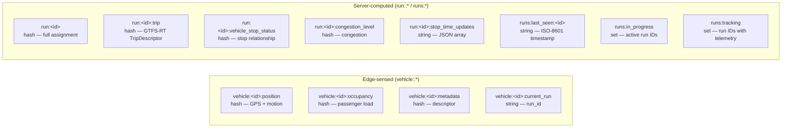

# Data Model

Databús uses two fundamentally different storage mechanisms for two different
purposes. Understanding the boundary between them is the key to reading any
piece of the system.

## Two namespaces, two purposes

**`vehicle:<id>:*`** keys are written by the MQTT consumer from raw edge
signals. They represent what the vehicle reports.

**`run:<id>:*` and `runs:*`** keys are written by the server — lifecycle
actions and the progression step. They represent what the server has
concluded from those signals.

This separation enforces the [single writer per responsibility](../concepts/principles.md)
principle and makes it clear who owns each piece of data.

## Pages in this section

| Page | What you will find |
| --- | --- |
| [Redis state keys](redis-keys.md) | Reference table: every key, type, fields, writer, reader, TTL |
| [Telemetry contracts](telemetry-contracts.md) | The typed `validate_for_write` / `from_redis` layer per leaf |
| [Django models](django-models.md) | PostgreSQL ORM models across all apps |
| [Schedule engine](schedule-engine.md) | The GTFS Schedule side of `schedule_engine` |

Start with [Redis state keys](redis-keys.md) — it is the canonical reference
that all other pages link to.
