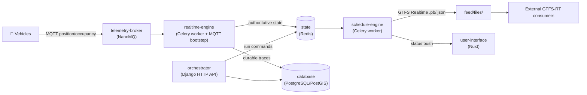

# Databús®

**Databús®** is a distributed [GTFS](concepts/gtfs.md) transit-data platform. It
ingests live vehicle telemetry over MQTT, maintains authoritative real-time state
in Redis, computes vehicle progress against scheduled trips through server-side
map-matching, and publishes standards-compliant **GTFS Realtime** feeds —
alongside durable traces and analytics.

!!! warning "Work in Progress"

    Both Databús® and its documentation are under active development. The estimated
    release date is **August 2026**. Pages describe the system **as built today**;
    where the legacy `AGENTS.md` / `MODEL.md` design docs disagree with the source,
    these docs follow the source.

## How it fits together

The MQTT consumer runs as a [Celery bootstep](data-flow/telemetry-ingestion.md)
inside the `realtime-engine` worker, not as a separate process. GTFS Realtime
feeds are built by the [`schedule-engine`](data-flow/gtfs-rt-publishing.md), not a
standalone "publisher." See [Architecture → Services](architecture/services.md)
for the full, corrected service map.

## Start here

-   :lucide-lightbulb:{ .lg .middle } **Concepts**

    ---

    What Databús® is, GTFS Schedule vs Realtime, the glossary, and the design
    principles behind the system.

    [:octicons-arrow-right-24: Concepts](concepts/index.md)

-   :lucide-network:{ .lg .middle } **Architecture**

    ---

    The service topology as built — Django apps and Celery workers, messaging
    model, and state & persistence.

    [:octicons-arrow-right-24: Architecture](architecture/index.md)

-   :lucide-route:{ .lg .middle } **Data flow**

    ---

    The end-to-end path: telemetry ingestion → server-side processing →
    map-matching → GTFS Realtime publishing.

    [:octicons-arrow-right-24: Data flow](data-flow/index.md)

-   :lucide-git-branch:{ .lg .middle } **Run lifecycle**

    ---

    The run state machine, commands vs detected facts, the detection layer, and
    stale-run scanning.

    [:octicons-arrow-right-24: Run lifecycle](runs/index.md)

-   :lucide-database:{ .lg .middle } **Data model**

    ---

    The canonical Redis key reference, telemetry contracts, Django models, and
    the schedule engine.

    [:octicons-arrow-right-24: Data model](data-model/index.md)

-   :lucide-plug:{ .lg .middle } **Interfaces**

    ---

    REST API, the MQTT telemetry contract, AMQP event semantics, GTFS Realtime
    feeds, and the URL directory.

    [:octicons-arrow-right-24: Interfaces](interfaces/index.md)

-   :lucide-terminal:{ .lg .middle } **Operations**

    ---

    Local development, configuration, Celery workers and beat, production
    deployment, and troubleshooting.

    [:octicons-arrow-right-24: Operations](operations/index.md)

---

Databús® is developed by the [SIMOVI Lab](https://simovilab.org) at the University
of Costa Rica (UCR). Source: [github.com/simovilab/databus](https://github.com/simovilab/databus).
