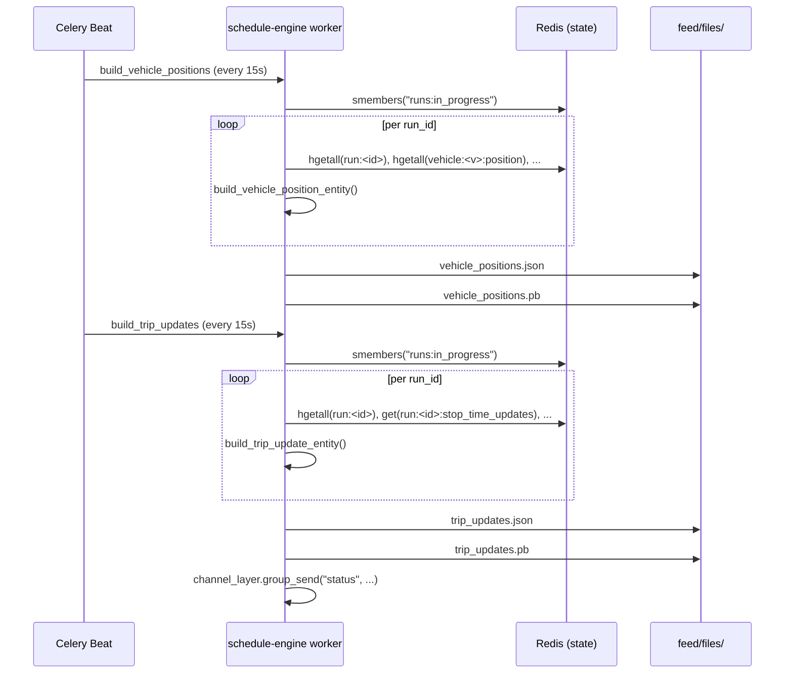

# GTFS Realtime Feeds

Databús® publishes GTFS Realtime feeds that any standard GTFS-RT consumer
(transit app, aggregator, analytics pipeline) can ingest.

**Refresh cadence:** every **15 seconds** (driven by Celery Beat).

**Output location:** `backend/feed/files/` (inside the `orchestrator` container;
served statically in production).

---

## Feed files

| File | Format | Entity type | Cadence |
| --- | --- | --- | --- |
| `vehicle_positions.pb` | Protocol Buffer (binary) | `VehiclePosition` | 15 s |
| `vehicle_positions.json` | JSON (debug) | `VehiclePosition` | 15 s |
| `trip_updates.pb` | Protocol Buffer (binary) | `TripUpdate` | 15 s |
| `trip_updates.json` | JSON (debug) | `TripUpdate` | 15 s |

!!! warning "ServiceAlert feed: stub"
    `build_alerts` runs every 10 s but returns the string
    `"Feed ServiceAlert built"` without producing a file. No
    `service_alerts.pb` is written. ServiceAlert emission is planned for a
    future release.

---

## VehiclePositions feed

Assembled by `schedule_engine.tasks.build_vehicle_positions` →
`builders.build_vehicle_positions_feed(r)`.

**What it contains per entity:**

| GTFS-RT field | Source | Notes |
| --- | --- | --- |
| `entity.id` | `vehicle_id` | |
| `vehicle.trip.trip_id` | `run:<id>:trip` → `trip_id` | Falls back to `run:<id>` hash |
| `vehicle.trip.route_id` | `run:<id>:trip` → `route_id` | |
| `vehicle.trip.direction_id` | `run:<id>:trip` → `direction_id` | |
| `vehicle.trip.schedule_relationship` | `run:<id>:trip` → `schedule_relationship` | Defaults to `SCHEDULED` |
| `vehicle.trip.start_time` | `run:<id>:trip` → `start_time` | |
| `vehicle.trip.start_date` | `run:<id>:trip` → `start_date` | |
| `vehicle.vehicle.id` | `vehicle:<id>:metadata` → `id` | |
| `vehicle.vehicle.label` | `vehicle:<id>:metadata` → `label` | |
| `vehicle.vehicle.license_plate` | `vehicle:<id>:metadata` → `license_plate` | Omitted if absent |
| `vehicle.position.latitude` | `vehicle:<id>:position` → `latitude` | |
| `vehicle.position.longitude` | `vehicle:<id>:position` → `longitude` | |
| `vehicle.position.bearing` | `vehicle:<id>:position` → `bearing` | Omitted if absent |
| `vehicle.position.speed` | `vehicle:<id>:position` → `speed` | Omitted if absent |
| `vehicle.timestamp` | `vehicle:<id>:position` → `timestamp` | Lifted from position hash; falls back to `now()` |
| `vehicle.current_stop_sequence` | `run:<id>:vehicle_stop_status` | Omitted if absent |
| `vehicle.stop_id` | `run:<id>:vehicle_stop_status` | Omitted if absent |
| `vehicle.current_status` | `run:<id>:vehicle_stop_status` | Omitted if absent |
| `vehicle.occupancy_status` | `vehicle:<id>:occupancy` → `occupancy_status` | Server-bucketed |
| `vehicle.occupancy_percentage` | `vehicle:<id>:occupancy` → `occupancy_percentage` | Omitted if absent |
| `vehicle.congestion_level` | `run:<id>:congestion_level` | Omitted if hash is absent |

A run is **skipped** if its `run:<id>` hash is empty, if it has no `vehicle`
field, or if all of position/occupancy/stop-status hashes are empty.

---

## TripUpdates feed

Assembled by `schedule_engine.tasks.build_trip_updates` →
`builders.build_trip_updates_feed(r)`.

**What it contains per entity:**

| GTFS-RT field | Source |
| --- | --- |
| `entity.id` | `vehicle_id` |
| `trip_update.trip.*` | `run:<id>:trip` (same as VehiclePositions) |
| `trip_update.vehicle.*` | `vehicle:<id>:metadata` |
| `trip_update.timestamp` | `vehicle:<id>:position.timestamp` (falls back to `now()`) |
| `trip_update.stop_time_update[]` | `run:<id>:stop_time_updates` (JSON string) |

Each `StopTimeUpdate` entry:

```json
{
    "stop_sequence": 42,
    "stop_id": "STOP_ID",
    "arrival": {
        "time": 1718800000,
        "uncertainty": 60
    },
    "departure": {
        "time": 1718800000,
        "uncertainty": 60
    }
}
```

If `run:<id>:stop_time_updates` is absent, expired (TTL elapsed), or empty,
the entity is emitted with an empty `stop_time_update` list — this is an
honest representation of no-data, not an error.

A run is **skipped** if both position and stop-status hashes are empty.

---

## Feed assembly pipeline



After writing `trip_updates.pb`, the task pushes a WebSocket heartbeat to the
`status` channel group — connected frontend clients receive a message with
`last_update` timestamp and `runs` count. See
[Data flow › Live updates](../data-flow/live-updates.md).

---

## Consuming the feeds

### Protobuf

```python
from google.transit import gtfs_realtime_pb2

msg = gtfs_realtime_pb2.FeedMessage()
msg.ParseFromString(open("backend/feed/files/vehicle_positions.pb", "rb").read())
print(len(msg.entity))  # number of active runs in the feed
```

### JSON (debug)

The `.json` files are valid GTFS-RT JSON that can be viewed with any text
editor. They are intended for debugging, not for production ingestion (use
the protobuf files for that).

---

## Source files

- `backend/schedule_engine/tasks.py` — Celery tasks
- `backend/schedule_engine/builders.py` — pure assembly functions
- `backend/databus/celery.py` — beat schedule (15 s / 15 s / 10 s cadence)
- `backend/runs/domain/telemetry/` — contract modules used by builders
- `backend/feed/files/` — output directory (mounted as a volume in production)
