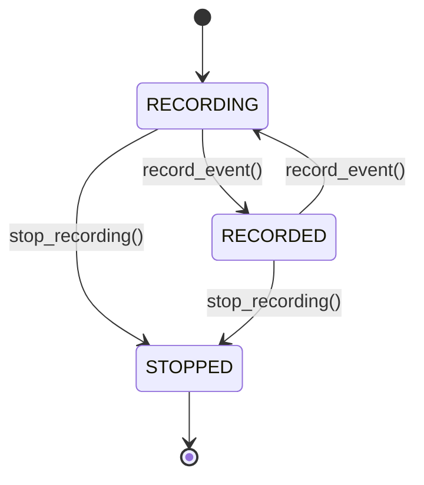

# Record Run Events

```mermaid
stateDiagram-v2
    [*] --> RECORDING
    RECORDING --> RECORDED : record_event()
    RECORDING --> STOPPED : stop_recording()
    RECORDED --> RECORDING : record_event()
    RECORDED --> STOPPED : stop_recording()
    STOPPED --> [*]
```
