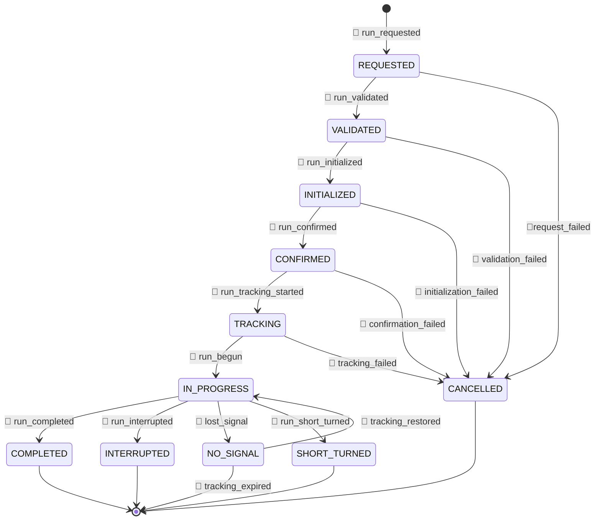

# Run Lifecycle

This processes handles the main events in a run lifecycle, such as creation, completion, and failure. It follows the state machine defined in the [Run State Machine](../concepts/run-state-machine.md) documentation.

What happens inside a request-response cycle has to be synchronous

- `POST api/create-run`
  - response: `run_lifecycle_state = INITIALIZED`
- `POST api/update-run`
  - request: `event: RUN_CONFIRMED`
    - response: `run_lifecycle_state = TRACKING`
  - request: `event: RUN_COMPLETED`
    - response: `run_lifecycle_state = COMPLETED`
  - request: `event: RUN_INTERRUPTED`
    - response: `run_lifecycle_state = INTERRUPTED`
  - request: `event: RUN_SHORT_TURNED`
    - response: `run_lifecycle_state = SHORT_TURNED`

REQUESTED
VALIDATED
INITIALIZED
CONFIRMED
TRACKING
IN_PROGRESS
NO_SIGNAL
COMPLETED
INTERRUPTED
CANCELLED
SHORT_TURNED
