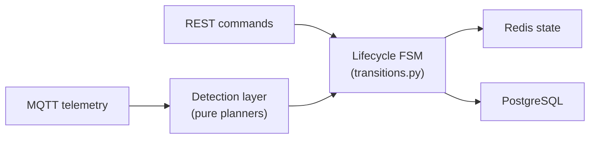

# Run lifecycle

A **run** is the unit of operational work in Databús: a vehicle assigned to a trip, tracked from the first GPS ping to the last stop. The run lifecycle governs how that work progresses through states and how the system reacts to events.

The lifecycle is implemented as one finite state machine, plus a per-tick computation that plays a related but separate role:

1. **Lifecycle FSM** — tracks the operational phase of the run (`Requested` → `Confirmed` → `Tracking` → `In Progress` → `Completed`, plus deviation paths). Driven by commands from operators and by detected facts from telemetry. Implemented in `backend/runs/domain/lifecycle/`.

2. **Progress FSM (motion)** — a second, separate state machine for vehicle motion (`IS_MOVING` / `IS_STOPPED` / `IS_PAUSED`) described in `MODEL.md`. This is design intent only: no such FSM exists in the code. A structural scaffold once lived at `backend/runs/domain/progress/`, but it was dead code (never wired to a live call path) and was deleted in commit `a3cbb0a`. The active stand-in is a stateless per-tick computation in `backend/runs/domain/progression/compute.py` that classifies the vehicle's relationship to its next stop (`STOPPED_AT` / `INCOMING_AT` / `IN_TRANSIT_TO`) on every position update — see [progress-fsm.md](progress-fsm.md).

The detection layer sits between the MQTT telemetry stream and the lifecycle FSM. It converts raw position and occupancy signals into lifecycle events without any I/O of its own.

| Page | What it covers |
|---|---|
| [States & transitions](lifecycle-states.md) | All 11 states, the full transition table, guards, and actions |
| [Commands vs detected facts](commands-vs-detections.md) | Which events are operator-driven vs telemetry-driven; the `run_completed` rename |
| [Detection layer](detection.md) | Pure planners, detector registry, impure wrappers |
| [Progress FSM (motion)](progress-fsm.md) | Design intent for a motion-state machine (IS_MOVING / IS_STOPPED / IS_PAUSED); the active per-tick stop-status computation that stands in for it today |
| [Stale-run scanning](stale-runs.md) | `scan_stale_runs` periodic task, grace/expiry thresholds |
