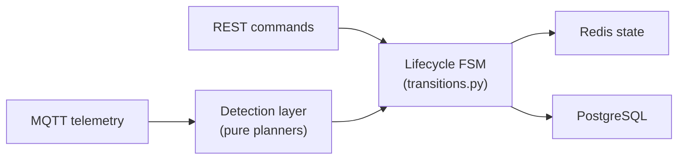

# Run lifecycle

A **run** is the unit of operational work in Databús: a vehicle assigned to a trip, tracked from the first GPS ping to the last stop. The run lifecycle governs how that work progresses through states and how the system reacts to events.

The lifecycle is implemented as two cooperating finite state machines:

1. **Lifecycle FSM** — tracks the operational phase of the run (`Requested` → `Confirmed` → `Tracking` → `In Progress` → `Completed`, plus deviation paths). Driven by commands from operators and by detected facts from telemetry.

2. **Progress FSM** — tracks the vehicle's motion state within a run. A parallel FSM in `backend/runs/domain/progress/`.

The detection layer sits between the MQTT telemetry stream and the lifecycle FSM. It converts raw position and occupancy signals into lifecycle events without any I/O of its own.

| Page | What it covers |
|---|---|
| [States & transitions](lifecycle-states.md) | All 11 states, the full transition table, guards, and actions |
| [Commands vs detected facts](commands-vs-detections.md) | Which events are operator-driven vs telemetry-driven; the `run_completed` rename |
| [Detection layer](detection.md) | Pure planners, detector registry, impure wrappers |
| [Progress FSM (motion)](progress-fsm.md) | The separate motion-state machine (IS_MOVING / IS_STOPPED / IS_PAUSED) |
| [Stale-run scanning](stale-runs.md) | `scan_stale_runs` periodic task, grace/expiry thresholds |
