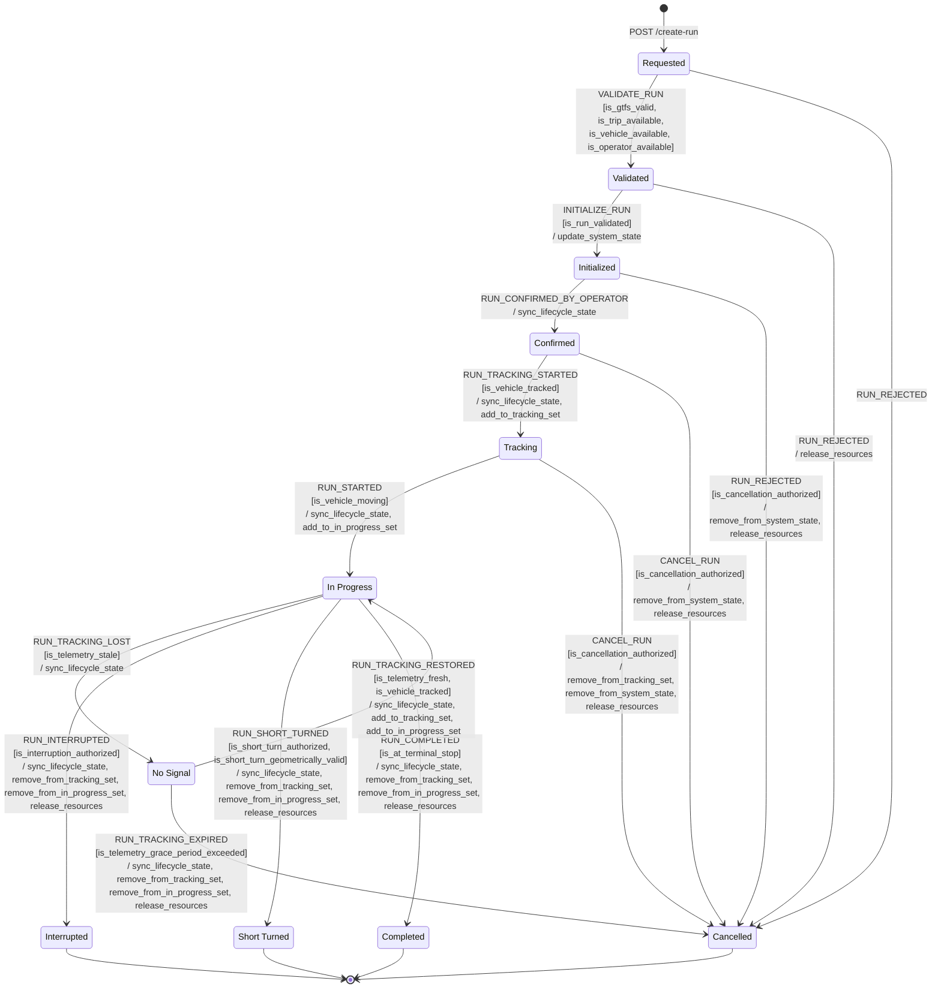

# States & transitions

The run lifecycle FSM is defined in `backend/runs/domain/lifecycle/`. Every run moves through exactly one state at a time; every state change requires a matching event, a passing set of guards, and the execution of a set of actions.

!!! warning "State name correction"
    Older design drafts used `CANCELED`. The code uses `"Cancelled"` (British
    spelling, mixed case). Always use the value from `RunLifecycleStates` —
    never the enum member name.

## State set

Defined in `backend/runs/domain/lifecycle/states.py` as `RunLifecycleStates(str, Enum)`:

| Enum member | Value (str) | Meaning |
|---|---|---|
| `REQUESTED` | `"Requested"` | API call received; run record created |
| `VALIDATED` | `"Validated"` | GTFS consistency and resource availability confirmed |
| `INITIALIZED` | `"Initialized"` | Redis state populated; resources claimed |
| `CONFIRMED` | `"Confirmed"` | Operator (driver/dispatcher) has acknowledged |
| `TRACKING` | `"Tracking"` | First telemetry received; GPS tracking active |
| `IN_PROGRESS` | `"In Progress"` | Vehicle is moving along the route |
| `NO_SIGNAL` | `"No Signal"` | Telemetry went silent; grace window running |
| `COMPLETED` | `"Completed"` | Vehicle reached the terminal stop |
| `INTERRUPTED` | `"Interrupted"` | Run manually or automatically aborted mid-route |
| `SHORT_TURNED` | `"Short Turned"` | Run terminated at a non-terminal stop |
| `CANCELLED` | `"Cancelled"` | Rejected, cancelled before start, or expired |

## State diagram



## Transition table

Full table from `backend/runs/domain/lifecycle/transitions.py`:

| From | Event | To | Guards | Actions |
|---|---|---|---|---|
| `Requested` | `VALIDATE_RUN` | `Validated` | `is_gtfs_valid`, `is_trip_available`, `is_vehicle_available`, `is_operator_available` | — |
| `Requested` | `RUN_REJECTED` | `Cancelled` | — | — |
| `Validated` | `INITIALIZE_RUN` | `Initialized` | `is_run_validated` | `update_system_state` |
| `Validated` | `RUN_REJECTED` | `Cancelled` | — | `release_resources` |
| `Initialized` | `RUN_CONFIRMED_BY_OPERATOR` | `Confirmed` | — | `sync_lifecycle_state` |
| `Initialized` | `RUN_REJECTED` | `Cancelled` | `is_cancellation_authorized` | `remove_from_system_state`, `release_resources` |
| `Confirmed` | `RUN_TRACKING_STARTED` | `Tracking` | `is_vehicle_tracked` | `sync_lifecycle_state`, `add_to_tracking_set` |
| `Confirmed` | `CANCEL_RUN` | `Cancelled` | `is_cancellation_authorized` | `remove_from_system_state`, `release_resources` |
| `Tracking` | `RUN_STARTED` | `In Progress` | `is_vehicle_moving` | `sync_lifecycle_state`, `add_to_in_progress_set` |
| `Tracking` | `CANCEL_RUN` | `Cancelled` | `is_cancellation_authorized` | `remove_from_tracking_set`, `remove_from_system_state`, `release_resources` |
| `In Progress` | `RUN_TRACKING_LOST` | `No Signal` | `is_telemetry_stale` | `sync_lifecycle_state` |
| `In Progress` | `RUN_INTERRUPTED` | `Interrupted` | `is_interruption_authorized` | `sync_lifecycle_state`, `remove_from_tracking_set`, `remove_from_in_progress_set`, `release_resources` |
| `In Progress` | `RUN_SHORT_TURNED` | `Short Turned` | `is_short_turn_authorized`, `is_short_turn_geometrically_valid` | `sync_lifecycle_state`, `remove_from_tracking_set`, `remove_from_in_progress_set`, `release_resources` |
| `In Progress` | `RUN_COMPLETED` | `Completed` | `is_at_terminal_stop` | `sync_lifecycle_state`, `remove_from_tracking_set`, `remove_from_in_progress_set`, `release_resources` |
| `No Signal` | `RUN_TRACKING_RESTORED` | `In Progress` | `is_telemetry_fresh`, `is_vehicle_tracked` | `sync_lifecycle_state`, `add_to_tracking_set`, `add_to_in_progress_set` |
| `No Signal` | `RUN_TRACKING_EXPIRED` | `Cancelled` | `is_telemetry_grace_period_exceeded` | `sync_lifecycle_state`, `remove_from_tracking_set`, `remove_from_in_progress_set`, `release_resources` |

## Guards

Defined in `backend/runs/domain/lifecycle/guards.py`.

**Registration guards:**

- `is_gtfs_valid` — checks that `route_id`, `trip_id`, `direction_id`, `shape_id`, and `schedule_relationship` are present and consistent with the current GTFS feed in PostgreSQL.
- `is_trip_available` — checks Redis `trip:<trip_id>:current_run` is not already assigned to another run.
- `is_vehicle_available` — checks Redis `vehicle:<vehicle_id>:current_run` is not assigned elsewhere.
- `is_operator_available` — checks Redis `operator:<operator_id>:current_run` is not assigned elsewhere.
- `is_run_validated` — always returns `True`; placeholder for future validation checks.

**Authorization guards:**

- `is_cancellation_authorized` — allows `actor_role` in `{"system", "dispatcher", "operator"}`.
- `is_interruption_authorized` — allows `actor_role` in `{"system", "dispatcher", "operator"}`.
- `is_short_turn_authorized` — allows `actor_role` in `{"dispatcher", "system"}` only (not plain operator).
- `is_short_turn_geometrically_valid` — checks that the proposed short-turn stop is on the trip and is not the terminal stop.

**Telemetry guards:**

- `is_vehicle_tracked` — checks `SISMEMBER runs:tracking <run_id>` in Redis.
- `is_vehicle_moving` — checks `speed > 0.5` m/s in the payload.
- `is_telemetry_stale` — checks `staleness > TELEMETRY_GRACE_S` (60 s).
- `is_telemetry_fresh` — checks `staleness <= TELEMETRY_GRACE_S` (60 s).
- `is_telemetry_grace_period_exceeded` — checks `staleness > TELEMETRY_EXPIRY_S` (600 s).
- `is_at_terminal_stop` — checks that the `stop_id` in the payload matches the last stop of the run's trip in the current GTFS feed.

## Actions

Defined in `backend/runs/domain/lifecycle/actions.py`. All actions execute synchronously inside the `run_lifecycle_event` Celery task.

- `update_system_state` — writes the full run hash to `run:<id>` in Redis; writes the GTFS-RT-shaped TripDescriptor to `run:<id>:trip`; claims `vehicle:<id>:current_run`, `operator:<id>:current_run`, and `trip:<trip_id>:current_run`; writes `vehicle:<id>:metadata`.
- `sync_lifecycle_state` — updates only the `run_lifecycle_state` field in `run:<id>`.
- `add_to_tracking_set` — `SADD runs:tracking <run_id>`.
- `remove_from_tracking_set` — `SREM runs:tracking <run_id>`.
- `add_to_in_progress_set` — `SADD runs:in_progress <run_id>`.
- `remove_from_in_progress_set` — `SREM runs:in_progress <run_id>`.
- `remove_from_system_state` — `DEL run:<id>`, `SREM runs:tracking`, `SREM runs:in_progress`.
- `release_resources` — `DEL vehicle:<id>:current_run`, `DEL operator:<id>:current_run`, `DEL trip:<trip_id>:current_run`.

!!! note "runs:tracking is a work queue, not a status flag"
    A comment in `transitions.py` makes this explicit: when `IN_PROGRESS` transitions to `NO_SIGNAL`, the run is **not** removed from `runs:tracking`. The set is the work queue for `scan_stale_runs` — it must include `NO_SIGNAL` runs so the periodic scan can later fire `RUN_TRACKING_EXPIRED`. Only fully-terminal transitions (Completed, Interrupted, Short Turned, Cancelled) remove from the tracking set.

## Events reference

All events from `backend/runs/domain/lifecycle/events.py`:

```python
class RunLifecycleEvents(str, Enum):
    RUN_REQUESTED = "run_requested"
    VALIDATE_RUN = "validate_run"
    INITIALIZE_RUN = "initialize_run"
    RUN_CONFIRMED_BY_OPERATOR = "run_confirmed_by_operator"
    RUN_TRACKING_STARTED = "run_tracking_started"
    RUN_STARTED = "run_started"
    RUN_COMPLETED = "run_completed"
    RUN_REJECTED = "run_rejected"
    CANCEL_RUN = "cancel_run"
    RUN_INTERRUPTED = "run_interrupted"
    RUN_SHORT_TURNED = "run_short_turned"
    RUN_TRACKING_LOST = "run_tracking_lost"
    RUN_TRACKING_RESTORED = "run_tracking_restored"
    RUN_TRACKING_EXPIRED = "run_tracking_expired"
```

For which of these are commands vs detected facts, see [commands-vs-detections.md](commands-vs-detections.md).
