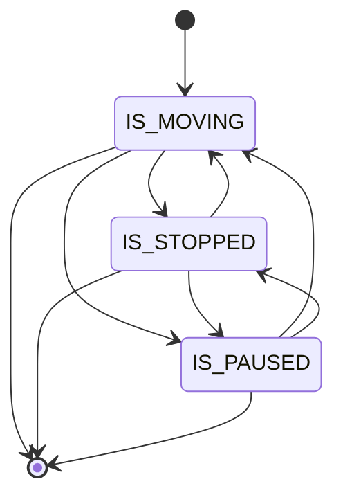

# Progress FSM (motion)

`MODEL.md` describes a second, separate state machine for vehicle motion that runs concurrently with the lifecycle FSM. This page documents the design intent and the current implementation status.

!!! warning "Implementation gap"
    The motion FSM described in `MODEL.md` (`IS_MOVING` / `IS_STOPPED` / `IS_PAUSED`) does not yet exist in the code as a working service. The `backend/runs/domain/progress/` module exists as a structural scaffold, but its state enum (`RunProgressStates`) mirrors the lifecycle states rather than the motion states, and the `RunProgressService` in `backend/runs/services/progress.py` is a stub (no active call path, hardcoded `current_stop = 1`). This page describes both the design intent and the actual code state.

## Design intent (MODEL.md)

The motion FSM was intended to track how a vehicle is moving at a fine-grained level independent of the lifecycle phase. It runs inside a live run and produces a trace of labeled transitions.



| State | Meaning |
|---|---|
| `IS_MOVING` | Vehicle speed above threshold; progressing along route |
| `IS_STOPPED` | Vehicle stopped at or near a stop (dwell) |
| `IS_PAUSED` | Vehicle stationary but not at a scheduled stop (driver break, traffic, etc.) |

The FSM was designed to emit a trace — a sequence of labeled transitions carrying timestamps and position data — that could be consumed by the analytics pipeline for scheduling and on-time performance analysis.

## What exists in the code

`backend/runs/domain/progress/` contains:

- `states.py` — `RunProgressStates` enum: **identical to `RunLifecycleStates`** (Requested, Validated, …, Cancelled). Not the IS_MOVING/IS_STOPPED/IS_PAUSED states.
- `events.py` — `RunProgressEvents` enum: identical to `RunLifecycleEvents`.
- `transitions.py` — A transition table that mirrors `backend/runs/domain/lifecycle/transitions.py` exactly, using `RunProgressStates` and `RunProgressEvents`.
- `guards.py` — Copy of lifecycle guards.
- `actions.py` — Copy of lifecycle actions.

The `RunProgressService` in `backend/runs/services/progress.py` is a stub:

```python
class RunProgressService:
    def process_event(self, event, payload):
        run = self._load_run(payload)
        if not self._is_active(run):  # checks run_lifecycle_state == "IN_PROGRESS"
            return None
        ...
    def _detect_stop_events(self, run, context):
        current_stop = 1  # TODO: self._infer_current_stop(run, context)
        ...
```

No task, celery entry point, or MQTT handler calls `RunProgressService.process_event`.

## Relationship to server-side progression

The server-side map-matching in `backend/runs/domain/progression/compute.py` produces a `vehicle_stop_status` dict with three states: `STOPPED_AT`, `INCOMING_AT`, `IN_TRANSIT_TO`. These correspond loosely to the motion FSM concept but are computed per telemetry tick and written to Redis as `run:<id>:vehicle_stop_status`, not as FSM transitions.

The stop-status computation uses:

- `STOP_RADIUS_M = 20.0` m — within this distance and low speed → `STOPPED_AT`
- `INCOMING_AT_RADIUS_M = 50.0` m — within this distance and still approaching → `INCOMING_AT`
- `STATIONARY_SPEED_MPS = 0.5` m/s — speed at or below this is considered dwell

This is the active implementation of stop-state detection. The motion FSM scaffold in `progress/` is not yet connected to it.

## Summary

| Aspect | Design intent (MODEL.md) | Current code |
|---|---|---|
| Motion states | `IS_MOVING`, `IS_STOPPED`, `IS_PAUSED` | Not implemented |
| Module location | `runs/domain/progress/` | Exists as a lifecycle mirror scaffold |
| Active service | `RunProgressService` | Stub — no live call path |
| Stop-state detection | Motion FSM transitions | Per-tick `compute.py` → `vehicle_stop_status` Redis hash |

The motion FSM is planned for implementation. When implemented, it will run alongside the lifecycle FSM and produce structured traces for the analytics pipeline.
