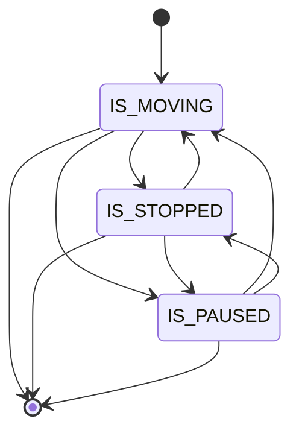

# Progress FSM (motion)

`MODEL.md` describes a second, separate state machine for vehicle motion that runs concurrently with the lifecycle FSM. This page documents the design intent and the current implementation status.

!!! warning "Design intent only — the scaffold was removed"
    The motion FSM described in `MODEL.md` (`IS_MOVING` / `IS_STOPPED` / `IS_PAUSED`) does not exist in the code, as a working service or otherwise. A structural scaffold once lived at `backend/runs/domain/progress/` (states/events/transitions/guards/actions mirroring the lifecycle FSM) plus a stub `RunProgressService` in `backend/runs/services/progress.py`, but neither ever had a live call path — the scaffold's state enum mirrored `RunLifecycleStates` rather than the motion states, and the service hardcoded `current_stop = 1`. Both were deleted as dead code during release cleanup, commit `a3cbb0a` ("refactor(runs): drop dead RunProgress FSM chain"). This page describes the design intent and the actual active implementation of stop-state detection, which is a different, simpler mechanism than the planned motion FSM.

## Design intent (MODEL.md)

The motion FSM was intended to track how a vehicle is moving at a fine-grained level independent of the lifecycle phase. It runs inside a live run and produces a trace of labeled transitions.

| State | Meaning |
|---|---|
| `IS_MOVING` | Vehicle speed above threshold; progressing along route |
| `IS_STOPPED` | Vehicle stopped at or near a stop (dwell) |
| `IS_PAUSED` | Vehicle stationary but not at a scheduled stop (driver break, traffic, etc.) |

The FSM was designed to emit a trace — a sequence of labeled transitions carrying timestamps and position data — that could be consumed by the analytics pipeline for scheduling and on-time performance analysis.

This remains future design intent. Nothing below is a step toward it; it is a separate, already-shipped mechanism that happens to answer a related question ("is the vehicle stopped at a stop right now?") without any FSM.

## What exists in the code: per-tick stop-status computation

There is no motion FSM in the code, dead or otherwise — the `progress/` scaffold and `RunProgressService` described above are gone. The **active** implementation of stop-state detection is a stateless, per-tick computation in `backend/runs/domain/progression/compute.py`, function `compute_stop_status`.

On every position update, `compute_stop_status`:

1. Loads the cached GTFS shape geometry for the run's `(shape_id, trip_id)`.
2. Projects the observed GPS point onto the shape polyline to get the along-track progress distance.
3. Picks the upcoming stop (the next stop ahead by progress distance, or the last stop if the vehicle has passed all of them).
4. Applies radius/speed rules to classify the vehicle against that stop:
   - `distance <= STOP_RADIUS_M` (20.0 m) AND (speed unknown OR `speed <= STATIONARY_SPEED_MPS` (0.5 m/s)) → `STOPPED_AT`
   - `distance <= INCOMING_AT_RADIUS_M` (50.0 m) AND still approaching (`point_progress_m < stop.progress_m`) → `INCOMING_AT`
   - otherwise → `IN_TRANSIT_TO`
5. Enforces a monotonic sequence floor: if the new candidate's `stop_sequence` would regress below the previous tick's, the previous sequence/stop_id are kept instead.

The whole computation is wrapped in `try/except Exception` and falls back to `IN_TRANSIT_TO` plus carry-forward of the previous state on any error (missing GTFS data, ORM errors, bad payloads) — it must never raise, since the caller runs it on every position tick.

This is a **stateless classification, not an FSM**: there are no explicit states, transitions, guards, or actions — just a pure function computing one of three status strings from the current tick's geometry. The only "memory" across ticks is the monotonic sequence floor.

### Where it's called and stored

`backend/runs/domain/progression/producer.py::produce_stop_status` is the impure wrapper: it reads `vehicle:<vehicle_id>:position` and `run:<run_id>` from Redis, calls `compute_stop_status`, validates the result, and writes it to `run:<run_id>:vehicle_stop_status` (Redis hash key from `backend/runs/domain/telemetry/keys.py::stop_status_key`).

It is invoked from `process_position_update` (`backend/realtime_engine/tasks.py`), which runs after every MQTT position write. The resulting `vehicle_stop_status` dict is then re-fed into `detect_from_telemetry(..., leaf="progression", ...)` so `RunCompletedDetector` can fire `run_completed` when `current_status == "STOPPED_AT"` — see [detection.md](detection.md) and [commands-vs-detections.md](commands-vs-detections.md) for that path.

## Summary

| Aspect | Design intent (MODEL.md) | Current code |
|---|---|---|
| Motion states | `IS_MOVING`, `IS_STOPPED`, `IS_PAUSED` | Not implemented |
| Scaffold module | (none planned — would be new) | `runs/domain/progress/` existed as an unused lifecycle-mirror scaffold; deleted in `a3cbb0a` |
| Stub service | (none planned — would be new) | `RunProgressService` existed as a dead stub; deleted in `a3cbb0a` |
| Stop-state detection | Motion FSM transitions with a trace | Stateless per-tick `compute_stop_status()` → `vehicle_stop_status` Redis hash (`run:<id>:vehicle_stop_status`) |

The motion FSM is still only a design idea in `MODEL.md`. If it is ever implemented, it would run alongside the lifecycle FSM and produce structured traces for the analytics pipeline — but that is unrelated to the per-tick stop-status computation described above, which already ships and already drives `run_completed` detection.
